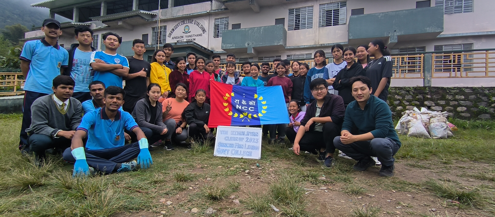
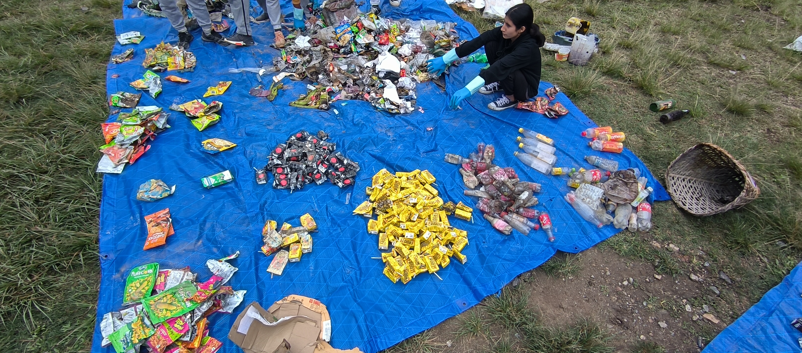
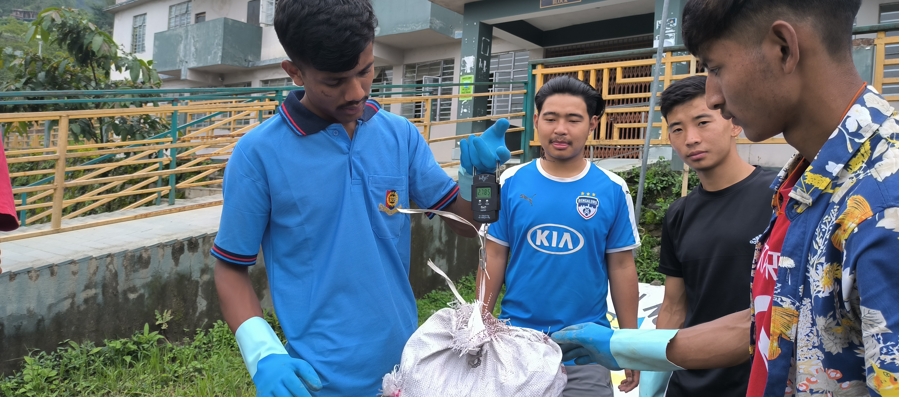
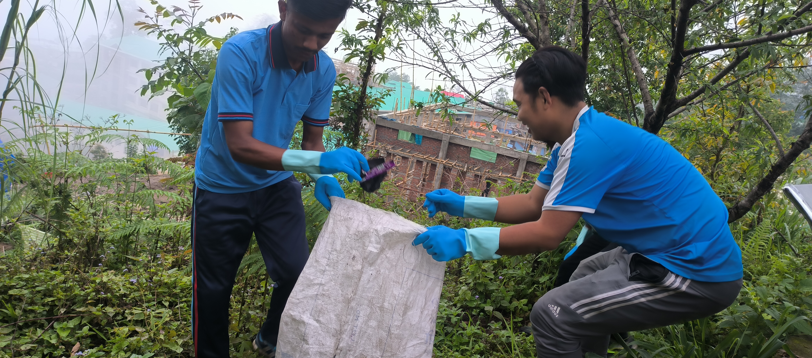
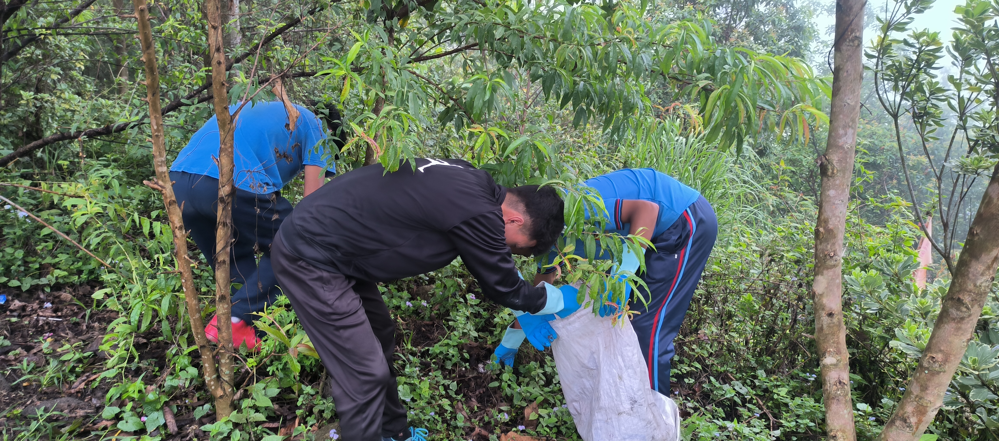

<html lang="en">
<head>
    <meta charset="UTF-8">
    <meta name="viewport" content="width=device-width, initial-scale=1.0">
    <title>Dept. of EVS/EHS</title>
    
</head>
<body>
    

        <h1>Dept. of EVS/EHS</h1>

        
Welcome to the official site of the Dept. of EVS/EHS, Sanchaman Limboo Govt. Degree College

        
        <h2>About the Department</h2>
        
The department of Environmental Studies/Eastern Himalayan Studies has been a part of Sanchaman Limboo Govt. Degree College, Arigaon, Gyalshing since its inception in the year 2011. The department’s main aim through its present curriculum is to offer students from various backgrounds a strong foundation regarding the various aspects of our environment and consequently the present plight for environmental protection. The content being taught at present is packaged in a way that makes it easier for students from differing backgrounds to understand and relate with the environment, this is done towards our conclusive goal of building a sense of responsibility in the students about the environment and its protection.

        
The department is currently run by 2 faculties, Mr Jigdol Tenzing Gyalpo Bhutia, the acting Head of Department, and Dr. Bikash Karki.

        <h2>About the Faculty</h2>
	

	
Jigdol Tenzing Gyalpo Bhutia

	
Details about faculty(placeholder)

	

	
Dr. Bikash Karki

	
Details about the faculty(placeholder)

        <h2>Course in the Department</h2>
        <table>
            <tr>
                <th>Sl. No</th>
                <th>Course Type</th>
                <th>Course Code</th>
                <th>Course Name</th>
            </tr>
            <tr>
                <td>1</td>
                <td>General Foundational Course</td>
                <td>HUR-UG-F105</td>
                <td>Environmental Studies</td>
            </tr>
            <tr>
                <td>2</td>
                <td>General Foundational Course</td>
                <td>HUR-UG-F106</td>
                <td>Eastern Himalayan Studies</td>
            </tr>
            <tr>
                <td>3</td>
                <td>Add-on</td>
                <td>N/A</td>
                <td>Environmental Impact Assessment</td>
            </tr>
            <tr>
                <td>4</td>
                <td>Add-on</td>
                <td>N/A</td>
                <td>Disaster Management</td>
            </tr>
        </table>
        
        <h2>Departmental Activities</h2>
        
The department of EVS/EHS conducts various activities throughout the academic session in order to keep its student body engaged. The activities vary in nature, some of them include academic activities which help the student express themselves while others include social activities in accordance with the college’s social responsibility. These activities are explained as follows:

        
        <h3>1. Brand/Waste Audit</h3>
        
The department in collaboration with Zero Waste Himalaya conducts an annual Brand/Waste Audit under the aegis of “The Himalayan Cleanup”. The activity sees participating students clean and collect waste from an area which is then segregated based on its type, furthermore details regarding the brand associated with that waste is documented. This activity helps the student learn what constitutes major waste types in an area. The students during the activity are also taught how to audit their own personal household waste so that they may learn to make better decision towards sustainability.

        
Below are a few pictures from waste audits conducted by the department.

        
        
        
        
        
        <h3>2. Cleanliness Drive</h3>
        
The department in accordance with its institutional social responsibility also conducts cleanliness drives in the college and also in communities and areas near the college. This is done bi-annually with students volunteers from different departments in collaboration with the Dept. Of EVS/EHS.

        
Below are a few pictures from the previous drive.

        
        
        
        <h3>3. Paper Recycling</h3>
        
    

</body>
</html>
